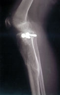
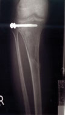

<TABLE CELLPADDING="0" CELLSPACING="0" BORDER="0" WIDTH="412">
	<TR>
		<TD VALIGN="TOP">
				
<H3>Dave Broke His Leg</H3>

				

January 29, 2001

				

					It was the freakiest thing, really.  On Friday, January 5th,
					<A onMouseOver="switchGraphic(7, 'Faces');return true;" onMouseOut="switchGraphic(2, 'Faces');return true;" href="Dave01">Dave</A>
					strapped on a pair of ice skates
					and walked out of the warming house.  He pushed off gently with his left skate to get moving.  Then, using more
					force, he pushed off with his right skate, but just when he did he heard (and obviously felt) a very big
					<B>crunch</B> in his right knee.
				

				

					As he dropped onto the ice he found his right leg in a somewhat contorted position &#151; bent at about 45
					degrees and turned in, sort of like a figure four.  The pain was pretty severe, and he immediately started going
					into shock.  After about a minute of sitting on the ice holding his knee,
					<A onMouseOver="switchGraphic(7, 'Faces');return true;" onMouseOut="switchGraphic(2, 'Faces');return true;" href="Jim01">Jim</A>
					noticed he was injured, and eventually got him to the hospital.
				

				

					Technically, the top 1/3 of his right tibia (the big bone that connects the knee to the ankle) had shattered,
					including the tibial plateau (the bottom half of the knee joint) &#151; the X-ray shows about 30 cracks.  When
					he had surgery on Tuesday the doctor bolted a plate to the side of the bone to hold the plateau in place, and he
					also added some "bone pellets" (donated bone tissue) to the area to promote new growth.
				

				

					Dave was released from the hospital the following Friday, and now he's stuck on the couch because he can't sit
					in a regular chair (and can't drive).  He obviously can not play the drums.
				

				

					Once the bone heals, Dave will undergo physical therapy to restore function in his knee and rebuild the
					surrounding muscles.  This process will likely take several weeks, if not months.  As a result,
					<B>Corum will not be practicing or performing until spring or summer of 2001</B>.
				

				
&nbsp;

				

April 9, 2001

				
These X-rays were taken on Thursday, April 5th &#151; exactly <b>three months</b> after the injury.

				<table align="center">
				<tr>
				  <td><a href="BrokenLegMLView"> medial-lateral</a></td>
				  <td><a href="BrokenLegAPView"> antero-posterior</a></td>
				</tr>
				</table>				
				
The <a href="BrokenLegMLView">medial-lateral view</a> still shows most of the cracks, and you can also see that the bone is no longer straight; it is "flexed" forward slightly. (In this view, the screws are pointing toward you.)

				
The <a href="BrokenLegAPView">antero-posterior view</a> looks much better: the bone is straight, and only the most severe cracks are visible.

				
&nbsp;

				
		</TD>
	</TR>
</TABLE>

