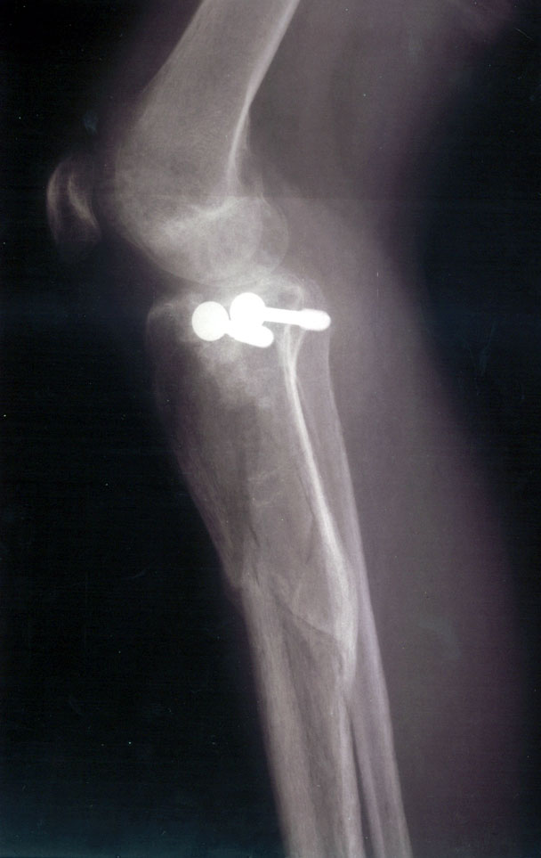

<TABLE CELLPADDING="0" CELLSPACING="0" BORDER="0" WIDTH="412">
	<TR>
		<TD VALIGN="TOP">
			
				
<H3>Dave's X-Rays</H3><A href="BrokenLeg">back</A>

				 
				medial-lateral view

				
<A href="BrokenLeg">back</A>

				
&nbsp;

			
		</TD>
	</TR>
</TABLE>
