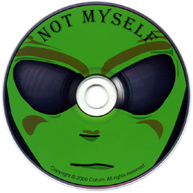

<table align="CENTER" cellspacing="0" BORDER="0"><TR><TD bgcolor="#FFFFFF" class="title"><H1><i>Not Myself</i> Credits</H1></TD></TR></table>
<table align="CENTER" cellspacing="0" cellpadding="0" BORDER="0">
	<tr>
		<td></td>
		<td>
			
				<NOBR>All songs written</NOBR> 
				<NOBR>&nbsp;&nbsp;and produced by Corum.</NOBR> &nbsp; 
				<NOBR>&nbsp;&nbsp;&nbsp;&nbsp;Engineered by Tom Sandelands.</NOBR> &nbsp; 
				<NOBR>&nbsp;&nbsp;&nbsp;&nbsp;&nbsp;&nbsp;Mixed by David Rand.</NOBR> &nbsp; 
				<NOBR>&nbsp;&nbsp;&nbsp;&nbsp;&nbsp;&nbsp;&nbsp;Mastered by Greg Reierson</NOBR> 
				<NOBR>&nbsp;&nbsp;&nbsp;&nbsp;&nbsp;&nbsp;&nbsp;&nbsp;at Precision Powerhouse.</NOBR> &nbsp; 
				<NOBR>&nbsp;&nbsp;&nbsp;&nbsp;&nbsp;&nbsp;&nbsp;&nbsp;Cover art by Nigel Brooks</NOBR> 
				<NOBR>&nbsp;&nbsp;&nbsp;&nbsp;&nbsp;&nbsp;&nbsp;and Matt Zeidler.</NOBR> &nbsp; 
				<NOBR>&nbsp;&nbsp;&nbsp;&nbsp;&nbsp;Other artwork by Kimberly</NOBR> 
				<NOBR>&nbsp;&nbsp;&nbsp;&nbsp;Volk and David Rand.</NOBR> &nbsp; 
				<NOBR>&nbsp;&nbsp;Artwork layout by</NOBR> 
				<NOBR>Beth Rasmussen.</NOBR>

			
		</td>
	</tr>
</table>