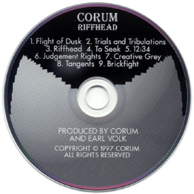

<table align="CENTER" cellspacing="0" BORDER="0"><TR><TD bgcolor="#FFFFFF" class="title"><H1><i>Riffhead</i> Credits</H1></TD></TR></table>
<table align="CENTER" cellspacing="0" cellpadding="0" BORDER="0">
	<tr>
		<td></td>
		<td>
			
				<NOBR>All songs written and</NOBR> 
				<NOBR>&nbsp;performed by Corum.</NOBR> &nbsp; 
				<NOBR>&nbsp;&nbsp;Produced, recorded, and</NOBR> 
				<NOBR>&nbsp;&nbsp;&nbsp;engineered by Corum</NOBR> 
				<NOBR>&nbsp;&nbsp;and Earl Volk.</NOBR> &nbsp; 
				<NOBR>&nbsp;Mixed and mastered by</NOBR> 
				<NOBR>Brian Bart at Logic Studios.</NOBR>

			
		</td>
	</tr>
</table>
